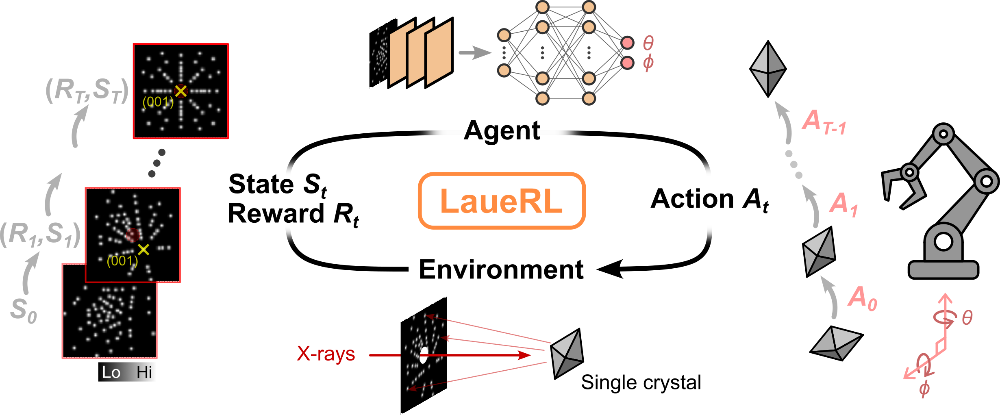

## Laue single crystal alignment using visual reinforcement learning

This repository is the official PyTorch implementation of <b>LaueRL</b>: a reinforcement-learning framework to train an agent to align single crystals using simulated x-ray Laue backreflection patterns.

<p align="center">

</p>

The original work can be found on **[arxiv](https://arxiv.org/abs/2604.11773)**[1].

The RL framework is based on model-free off-policy algorithms <a href="https://github.com/XuGW-Kevin/DrM">DrM</a>[2] and <a href="https://github.com/denisyarats/pytorch_sac">SAC</a>[3] with pixel observations.

[1] J. Oppliger, et al., "Autonomous Diffractometry Enabled by Visual Reinforcement Learning", arXiv:2604.11773 (2026)\
[2] G. Xu, et al.,"DrM: Mastering Visual Reinforcement Learning through Dormant Ratio Minimization", The Twelfth International Conference on Learning Representations (2024)\
[3] D. Yarats, and I. Kostrikov, "Soft Actor-Critic (SAC) implementation in PyTorch", GitHub (2020)

An agent can be trained using `train_agent.py`, for example:

```bash
python train_agent.py drm path_to_save_directory path_to_config_file
```

Example configuration files are located in the `config` directory.

Required packages (Python 3.9):

- torch 2.3.1
- torchvision 0.18.1
- torchinfo 1.8.0
- dm-control 1.0.23
- dm-env 1.6
- scipy 1.13.1
- numpy 1.26.3
- scikit-image 0.24.0
- pillow 10.2.0
- matplotlib 3.9.1
- mplstereonet 0.6.3
- imageio 2.35.1
- termcolor 1.1.0
